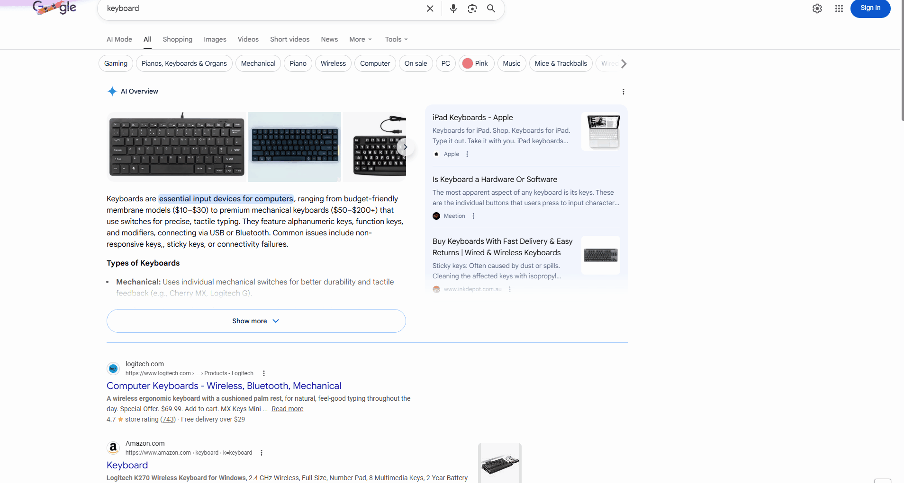
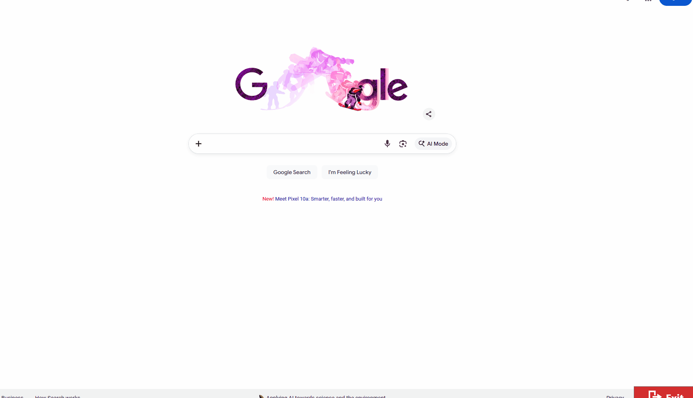

<p align="center">
  
</p>

# BrowserLauncher

A .NET application for managing multiple browser instances across monitors with WebView2. The Launcher spawns and monitors BrowserHost instances on configured screens.

## Features

- **Multi-monitor support**: Configure and launch independent browser instances on each monitor
- **Per-screen configuration**: Different URLs, exit behaviors, and localStorage settings per monitor
- **WebView2-based hosting**: Modern Chromium-based browser engine
- **Automatic process restart**: Monitors and restarts BrowserHost instances after crashes with configurable delay
- **Browser console logging**: Capture and log browser console messages to log4net
- **localStorage injection**: Set initial key/value pairs for web application state management
- **Optional DevTools window**: Debug tools available per screen
- **Flexible exit button control**: Show/hide exit button based on current URL with full configurability
- **Pull-to-refresh gesture**: Swipe down confirmation with `Refresh`, `Cancel`, `Home` options
- **Page navigation controls**: Quick return to configured home URL via gesture navigation
- **Touch-first on-screen keyboard**: Automatic launch on input field focus for touch interfaces
- **Monitor detection**: Automatic detection and position-based ordering (left-to-right) of monitors
- **Log cleanup**: Automatic cleanup of old launcher and browser logs based on configured retention days


## Demo


### Page Navigation / Home Flow



### On-Screen Keyboard on Touch Input



## Requirements

- .NET 8.0 Runtime
- Windows 10/11
- WebView2 Runtime (automatically installed if needed)

## Configuration

Edit `appsettings.json` to configure screens:

```json
{
  "RestartDelaySeconds": 3,
  "BrowserHostPath": "BrowserHost\\BrowserHost.exe",
  "LogCleanupDays": 10,
  "LogDirectory": "C:\\Temp\\BroswerHost",
  "EnableOnScreenKeyboard": true,
  "Screens": [
    {
      "MonitorIndex": 0,
      "RequireAllMonitors": false,
      "Url": "https://example.com",
      "AllowExit": true,
      "ExitUrl": "",
      "LogConsoleMessages": true,
      "DevTools": false,
      "LocalStorage": {
        "appState": {
          "userId": "user123"
        }
      }
    },
    {
      "MonitorIndex": 1,
      "RequireAllMonitors": false,
      "Url": "https://example.com/screen2",
      "AllowExit": false,
      "ExitUrl": "",
      "LogConsoleMessages": true,
      "DevTools": false,
      "LocalStorage": {}
    }
  ]
}
```

### Configuration Options

- **RestartDelaySeconds**: Delay in seconds before restarting BrowserHost after crash (default `3`)
- **BrowserHostPath**: Relative or absolute path to BrowserHost.exe
- **LogCleanupDays**: Number of days to retain launcher/browser logs before cleanup (default `10`)
- **LogDirectory**: Directory where logs are stored and cleaned up (default `C:\Temp\BroswerHost`)
- **EnableOnScreenKeyboard**: Enable automatic on-screen keyboard on touch input (default `true`)

#### Per-Screen Options

- **MonitorIndex**: Monitor number (0-based, left-to-right ordering)
- **RequireAllMonitors**: If `true`, screen only launches when all configured monitors are detected (default `false`)
- **Url**: Initial URL to load
- **AllowExit**: Controls exit button default visibility:
  - `true`: Exit button shows at the initial Url (or ExitUrl if specified)
  - `false`: Exit button only shows if ExitUrl matches current URL; if ExitUrl is empty, button never shows
- **ExitUrl**: URL where exit button should be visible. When empty:
  - If `AllowExit: true` → defaults to initial Url
  - If `AllowExit: false` → button never shows (remains empty)
- **LogConsoleMessages**: Log browser console messages to log4net (default `true`)
- **DevTools**: Open DevTools window on startup (default `false`)
- **LocalStorage**: Key/value pairs to inject into browser localStorage (supports nested objects)

## Running

```powershell
.\Published\Launcher.exe
```

## Exit Button Behavior

The exit button visibility is determined by URL matching against the `ExitUrl` configuration:

| Scenario | AllowExit | ExitUrl | Behavior |
|----------|-----------|---------|----------|
| Always visible | `true` | (empty) | Button shows at initial Url, hides on navigation |
| Always visible | `true` | "https://exit.com" | Button shows only at that specific URL |
| Never visible | `false` | (empty) | Button never appears |
| Exit via URL | `false` | "https://exit.com" | Button shows only at that specific URL |

The exit button exits the application cleanly (exit code 0) when clicked, triggering a graceful shutdown of all browser instances.

## Building

```powershell
# Build both projects
dotnet build

# Publish release build
dotnet publish Launcher/Launcher.csproj -c Release -r win-x64 --self-contained false -o Published
dotnet publish BrowserHost/BrowserHost.csproj -c Release -r win-x64 --self-contained false -o Published/BrowserHost
```

## Project Structure

- **Launcher**: Console app that spawns and monitors BrowserHost instances
- **BrowserHost**: WPF app that hosts WebView2 on a specific monitor

## Logs

- `launcher.log`: Launcher process events
- `browserhost-{MonitorIndex}.log`: Per-monitor browser logs
