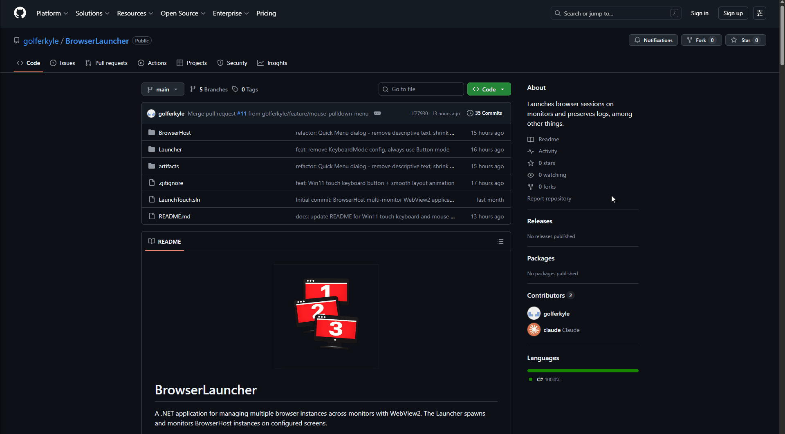

<p align="center">
  
</p>

# BrowserLauncher

A .NET application for managing multiple browser instances across monitors with WebView2. The Launcher spawns and monitors BrowserHost instances on configured screens.

## Features

- **Multi-monitor support**: Configure and launch independent browser instances on each monitor
- **Per-screen configuration**: Different URLs, exit behaviors, and localStorage settings per monitor
- **WebView2-based hosting**: Modern Chromium-based browser engine
- **Automatic process restart**: Monitors and restarts BrowserHost instances after crashes with configurable delay
- **Browser console logging**: Capture and log browser console messages to log4net
- **localStorage injection**: Set initial key/value pairs for web application state management
- **Optional DevTools window**: Debug tools available per screen
- **Flexible exit button control**: Show/hide exit button based on current URL with full configurability
- **Quick Menu (swipe/mouse)**: Pull-down overlay with `Refresh`, `Home`, `Cancel` (and optional `Exit`) actions, triggered by touch swipe or mouse hover on top-center hot zone
- **Mouse pull-down tab**: Borderless overlay tab anchored to the top-center of the screen; slides down when the mouse enters the hot zone, retracts after 2 s idle — no touch required
- **Page navigation controls**: Quick return to configured home URL via gesture or menu
- **Win11 touch keyboard button**: Persistent bottom bar with a keyboard toggle button using the native Win11 COM touch keyboard (`ITipInvocation`) — no `osk.exe` flicker
- **Smooth keyboard layout animation**: WebView2 content area shrinks/expands with configurable animation when the keyboard opens or closes
- **Auto-hide bottom bar**: Bottom bar can be configured to slide in/out on demand with a configurable timeout
- **Exit confirmation dialog**: Configurable confirmation prompt before exiting from the Quick Menu
- **Monitor detection**: Automatic detection and position-based ordering (left-to-right) of monitors
- **Log cleanup**: Automatic cleanup of old launcher and browser logs based on configured retention days


## Demo

### Quick Menu (swipe or mouse pull-down tab)


### Page Navigation / Home Flow


### New Bottom Bar


### Win11 Touch Keyboard Button



## Requirements

- .NET 8.0 Runtime
- Windows 10/11
- WebView2 Runtime (automatically installed if needed)

## Configuration

Edit `appsettings.json` to configure screens:

```json
{
  "RestartDelaySeconds": 3,
  "BrowserHostPath": "BrowserHost\\BrowserHost.exe",
  "LogCleanupDays": 10,
  "LogDirectory": "C:\\Temp\\BrowserHost",
  "EnableOnScreenKeyboard": true,
  "EnableOskFallback": false,
  "AutoHideBottomBar": false,
  "AlwaysAllowExit": false,
  "Screens": [
    {
      "MonitorIndex": 0,
      "RequireAllMonitors": false,
      "Url": "https://example.com",
      "AllowExit": true,
      "ExitUrl": "",
      "LogConsoleMessages": true,
      "DevTools": false,
      "BottomBarEnabled": true,
      "Zoom": 100,
      "LocalStorage": {
        "appState": {
          "userId": "user123"
        }
      }
    },
    {
      "MonitorIndex": 1,
      "RequireAllMonitors": false,
      "Url": "https://example.com/screen2",
      "AllowExit": false,
      "ExitUrl": "",
      "LogConsoleMessages": true,
      "DevTools": false,
      "BottomBarEnabled": true,
      "Zoom": 100,
      "LocalStorage": {}
    }
  ]
}
```

### Global Configuration Options

- **RestartDelaySeconds**: Delay in seconds before restarting BrowserHost after crash (default `3`)
- **BrowserHostPath**: Relative or absolute path to BrowserHost.exe
- **LogCleanupDays**: Number of days to retain launcher/browser logs before cleanup (default `10`)
- **LogDirectory**: Directory where logs are stored and cleaned up (default `C:\Temp\BrowserHost`)
- **EnableOnScreenKeyboard**: Enable the bottom bar keyboard button and Win11 touch keyboard (default `true`)
- **EnableOskFallback**: Fall back to `osk.exe` if the Win11 COM touch keyboard (`TabTip`) is unavailable (default `false`)
- **AutoHideBottomBar**: When `true`, the bottom bar auto-hides and slides in/out based on activity; when `false`, the bar is always visible (default `false`)
- **AlwaysAllowExit**: When `true`, an **Exit** button is always shown in the Quick Menu regardless of URL matching, prompting an exit confirmation (default `false`)

#### Per-Screen Options

- **MonitorIndex**: Monitor number (0-based, left-to-right ordering)
- **RequireAllMonitors**: If `true`, screen only launches when all configured monitors are detected (default `false`)
- **Url**: Initial URL to load
- **AllowExit**: Controls exit button default visibility:
  - `true`: Exit button shows at the initial Url (or ExitUrl if specified)
  - `false`: Exit button only shows if ExitUrl matches current URL; if ExitUrl is empty, button never shows
- **ExitUrl**: URL where exit button should be visible. When empty:
  - If `AllowExit: true` → defaults to initial Url
  - If `AllowExit: false` → button never shows (remains empty)
- **LogConsoleMessages**: Log browser console messages to log4net (default `true`)
- **DevTools**: Open DevTools window on startup (default `false`)
- **BottomBarEnabled**: Per-screen kill switch for the bottom bar; set `false` to hide the bar on a specific screen regardless of the global `AutoHideBottomBar` setting (default `true`)
- **Zoom**: Per-screen zoom level. Integer value 0-100+.
- **LocalStorage**: Key/value pairs to inject into browser localStorage (supports nested objects)

### UI Settings (`uisettings.json`)

Fine-grained animation and timing settings live in `BrowserHost/uisettings.json` (deployed next to `BrowserHost.exe`):

```json
{
  "KeyboardAnimationMs": 200,
  "KeyboardPollIntervalMs": 150,
  "BottomBarTimeoutSec": 5,
  "ExitConfirmPrompt": "Are you sure you want to Exit?"
}
```

- **KeyboardAnimationMs**: Duration in milliseconds for the WebView2 content-area resize animation when the touch keyboard opens or closes (default `200`)
- **KeyboardPollIntervalMs**: How often (in ms) the keyboard rectangle is polled to detect open/close state transitions (default `150`)
- **BottomBarTimeoutSec**: Seconds of inactivity before the bottom bar auto-hides when `AutoHideBottomBar` is `true` (default `5`)
- **ExitConfirmPrompt**: Custom confirmation message shown in the exit confirmation dialog (default `"Are you sure you want to Exit?"`)


## Running

```powershell
.\Published\Launcher.exe
```

## Exit Button Behavior

The exit button visibility is determined by URL matching against the `ExitUrl` configuration:

| Scenario | AllowExit | ExitUrl | Behavior |
|----------|-----------|---------|----------|
| Always visible | `true` | (empty) | Button shows at initial Url, hides on navigation |
| Always visible | `true` | "https://exit.com" | Button shows only at that specific URL |
| Never visible | `false` | (empty) | Button never appears |
| Exit via URL | `false` | "https://exit.com" | Button shows only at that specific URL |

The exit button exits the application cleanly (exit code 0) when clicked, triggering a graceful shutdown of all browser instances.

When `AlwaysAllowExit: true` is set globally, an **Exit** button is also available inside the Quick Menu at any time. Clicking it opens the `ExitConfirmWindow` dialog before shutting down.

## Quick Menu

The Quick Menu is a modal dialog that provides the following actions:

| Button | Action |
|--------|--------|
| **Refresh** | Reload the current page |
| **Home** | Navigate back to the configured `Url` |
| **Cancel** | Dismiss and return to the page |
| **Exit** | Shut down gracefully _(only shown when `AlwaysAllowExit: true`)_ |

### Triggering the Quick Menu

The Quick Menu can be opened two ways:

1. **Touch swipe down** — Swipe down from the top edge of the WebView2 area on a touch screen.
2. **Mouse pull-down tab** — Move the mouse cursor to the top-center region of the screen. A semi-transparent **Menu** tab slides down from above the screen edge. Click the tab to open the Quick Menu. The tab auto-retracts after 2 seconds of no interaction.

The pull-down tab is rendered in a separate borderless transparent `PullTabWindow` (its own HWND) that sits above WebView2, avoiding the WPF airspace problem. Mouse entry into the 180 px wide hot zone at the top-center of the screen is detected by polling `GetCursorPos` every 100 ms.

## Bottom Bar

A persistent bottom bar provides quick-access controls:

- **Keyboard button** (center): Toggles the Windows 11 native touch keyboard via COM (`ITipInvocation`). If `TabTip.exe` is not running it is started automatically before the toggle. Falls back to `osk.exe` only when `EnableOskFallback: true`.
- **Exit button** (right): Visible when the current URL matches the configured `ExitUrl` or when `AllowExit: true` at the initial URL.

### Auto-Hide Behavior

When `AutoHideBottomBar: true` the bar is hidden by default and slides up into view when:
- The touch keyboard opens (so the keyboard button remains accessible)
- A relevant interaction occurs

It retracts after `BottomBarTimeoutSec` seconds of inactivity (configured in `uisettings.json`).

Set `BottomBarEnabled: false` on an individual screen to completely suppress the bar for that display.

## Building

```powershell
# Build both projects
dotnet build

# Publish release build
dotnet publish Launcher/Launcher.csproj -c Release -r win-x64 --self-contained false -o Published
dotnet publish BrowserHost/BrowserHost.csproj -c Release -r win-x64 --self-contained false -o Published/BrowserHost
```

## Project Structure

- **Launcher**: Console app that spawns and monitors BrowserHost instances
- **BrowserHost**: WPF app that hosts WebView2 on a specific monitor
  - **Services/TouchKeyboardService**: Win11 COM-based touch keyboard toggle + visibility detection
  - **PullTabWindow**: Borderless transparent overlay window for the mouse pull-down tab
  - **ExitConfirmWindow**: Confirmation dialog shown before exiting from the Quick Menu

## Logs

- `launcher.log`: Launcher process events
- `browserhost-{MonitorIndex}.log`: Per-monitor browser logs
